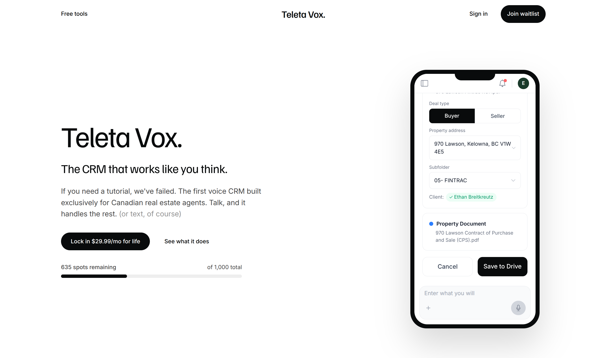
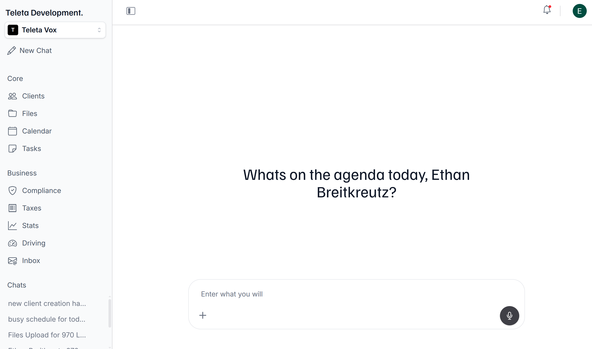
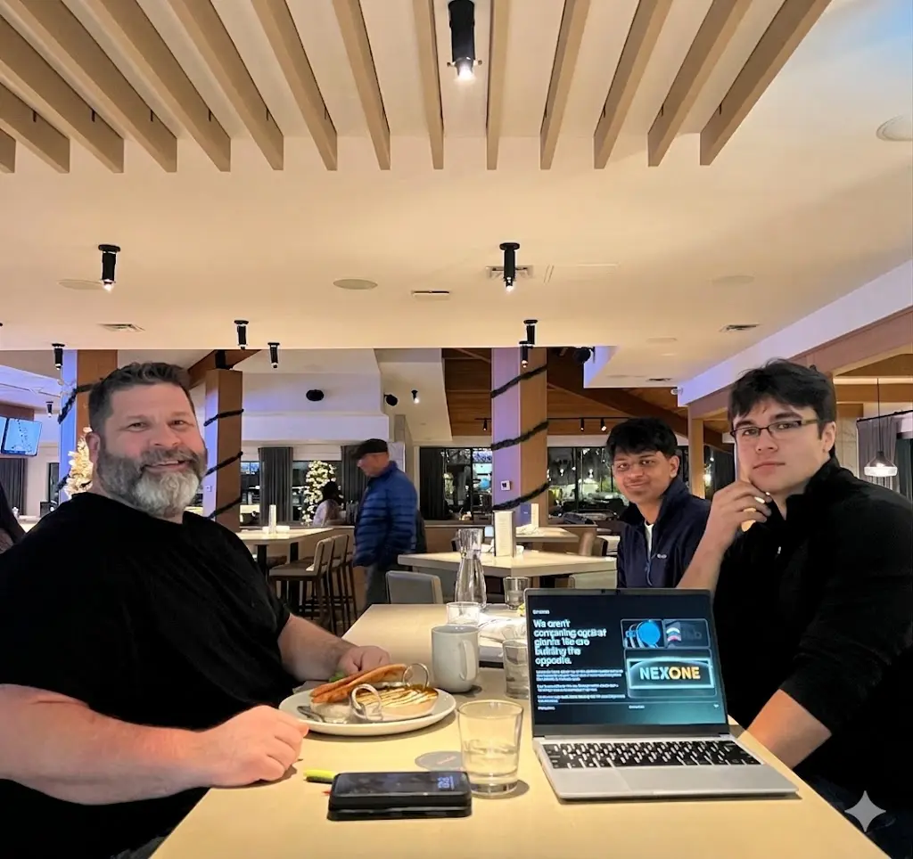

<div align="center">

# Teleta Vox

### The AI-powered CRM built for real estate professionals.

Voice-first client management, automated follow-ups, receipt scanning, and a concierge-grade interface that finally makes brokers _want_ to open their CRM.

<br />


<br />



</div>

---

## What it does

Teleta Vox is an end-to-end operating system for independent agents and small brokerages. Instead of making a user navigate a twelve-tab CRM, they hold down a button and _talk_. The agent understands intent, routes the request through the correct tool, and writes back to MongoDB.

A working conversation might sound like:

> _"Log a new buyer lead — Sarah Chen, three-bed in Capitol Hill, budget seven-fifty, saw her at the Sunday open house. Remind me to follow up Tuesday morning."_

That single utterance creates a client record, attaches a note, schedules a task, and files the source attribution — no typing, no forms.

---

## Core features

| Area                              | What it does                                                                                                             |
| --------------------------------- | ------------------------------------------------------------------------------------------------------------------------ |
| **Voice assistant**               | ElevenLabs streaming STT + TTS over WebSocket, wired to a Pydantic AI agent. Drives every CRUD operation in the app.     |
| **Client CRM**                    | Pipelines, notes, tagged sources, compliance disclosure tracking, import from CSV.                                       |
| **Tasks & scheduled follow-ups**  | APScheduler worker fires reminder emails and in-app nudges on the agent's behalf.                                        |
| **Inbox & calendar**              | Gmail + Google Calendar API integration — read, triage, reply, and create events from voice.                             |
| **Receipt scanning & tax ledger** | Snap a photo → vision model extracts line items → stored against a deductible category for year-end export.              |
| **Mileage log**                   | Tap-to-track driving sessions with route geometry, auto-calculated IRS-rate mileage.                                     |
| **Google Drive storage**          | `drive.file` scope — the user owns the files, we never see anything outside what we created.                             |
| **Compliance chat (RAG)**         | Qdrant vector store seeded with state-level real-estate law; agent retrieves citations before answering legal questions. |
| **Billing**                       | Stripe Checkout + webhook-driven plan upgrades. Solo / Pro, monthly or yearly.                                           |

<p align="center">
  
</p>

---

## Who it's for

Teleta Vox is built for the **solo real-estate agent and the two-to-ten person boutique brokerage** — the operators who live out of their phone, drive between showings, and have neither the time nor the stomach for a Salesforce implementation.

The target user is someone who:

- Runs their book of business on sticky notes, screenshots, and the iPhone Notes app.
- Loses deductions every April because receipts vanished into a glovebox.
- Doesn't want to become a CRM administrator — they want to sell houses.
- Would happily _talk_ to software if the software actually understood them.

We deliberately **do not** target enterprise brokerages with existing tech stacks. Our north-star customer is the producer who has outgrown a spreadsheet but refuses to be trained on Follow Up Boss.

---

## Architecture at a glance

```
          ┌──────────────────────┐      ┌──────────────────────┐
          │   Next.js 16 (App)   │◄────►│   FastAPI (Python)   │
          │   Auth.js · Tailwind │ SSE  │   Pydantic AI agent  │
          └──────────┬───────────┘      └──────────┬───────────┘
                     │                              │
          ┌──────────▼──────────────────────────────▼──────────┐
          │              MongoDB Atlas (shared)                │
          │   users · sessions · clients · tasks · receipts    │
          └────────────────────────────────────────────────────┘
                     │                              │
          ┌──────────▼──────────┐       ┌──────────▼──────────┐
          │   Qdrant (vector)   │       │  ElevenLabs · Gemini│
          │    compliance RAG   │       │  Stripe · Resend    │
          └─────────────────────┘       └─────────────────────┘
```

**Frontend** — Next.js 16 App Router, route-grouped dashboard, Auth.js v5 (Google / LinkedIn / Resend magic link), Tailwind + Framer Motion for the editorial motion language.

**Backend** — FastAPI with a single Pydantic AI agent that owns every tool function. Motor for async Mongo, APScheduler for the email worker, Qdrant for vector retrieval.

**AI layer** — OpenRouter routes to Gemini 2.5 Flash. Streaming SSE back to the frontend. A `VoxDeps` context object carries the user ID, timezone, plan, and session summary on every tool invocation, so the agent never confuses whose data it's touching.

**Auth model** — no separate backend auth layer. FastAPI reads the Auth.js session cookie and looks it up in Mongo's `sessions` collection. One source of truth, zero token-sync bugs.

---

## Infrastructure

We run the whole thing on a **DigitalOcean VPS** managed by **[Dokploy](https://dokploy.com/)** — a self-hosted Heroku/Vercel alternative. Dokploy points at our Docker Compose file, watches the Git repo, and handles zero-downtime redeploys, Let's Encrypt certs, and env-var injection.

- **Frontend** → `teletavox.com`
- **Backend** → `api.teletavox.com`
- **Qdrant** → named Docker volume, persisted across deploys
- **Database** → MongoDB Atlas (three environments: `local_testing` / `development` / `production`, switched by DB name in the URI)

This setup keeps our monthly infra bill under the cost of a single Vercel Pro seat, while giving us full control over the Python backend and the vector store.

---

## About the company

Teleta Vox is a two-founder, three-person company.

**Ethan Breitkreutz — Co-founder**

**Dave Alton — Co-founder**

**Advaith Madhus — Founding Engineer**

<p align="center">
  
</p>
<p align="center"><sub><i>↑ replace with a team photo</i></sub></p>

### Why we're building this

Real estate software is stuck in 2008. The incumbents sell by the seat to brokerages, which means the product serves the broker-owner, not the agent. We're flipping that: Teleta Vox is bought by the agent, lives on their phone, and treats the CRM as a _byproduct_ of them doing their job — not another job on top of it.

---

<div align="center">

**teletavox.com** &nbsp;

<sub>This repository is a showcase. The production source lives in a private monorepo.</sub>

</div>
